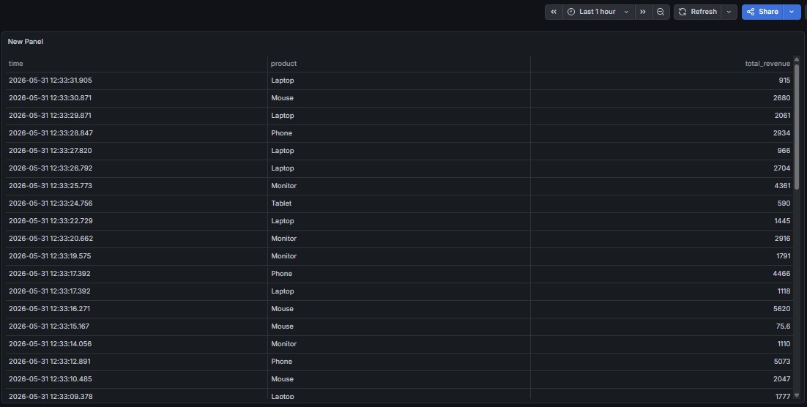
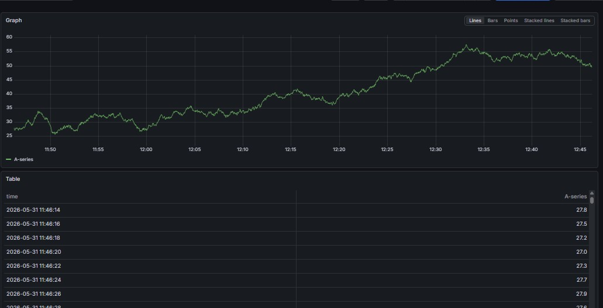

# 🚀 Streaming Sales Analytics Pipeline

[](https://www.python.org/)
[](https://redis.io/)
[](https://www.postgresql.org/)
[](https://grafana.com/)
[](https://www.docker.com/)

**Потоковая обработка данных о продажах в реальном времени.**


## 📊 Архитектура
Producer (Python) → Redis Queue → Consumer (Python) → PostgreSQL → Grafana

## Технологии

- Python + Faker (генератор данных)
- Redis (очередь сообщений)
- PostgreSQL (хранилище)
- Grafana (дашборд)
- Docker Compose (оркестрация)

## Быстрый старт

```bash
git clone https://github.com/kristina-firsova-23/streaming-sales-analytics.git
cd streaming-sales-analytics
docker-compose up -d
pip install -r requirements.txt
python producer/sales_producer.py
python consumer/processor.py
